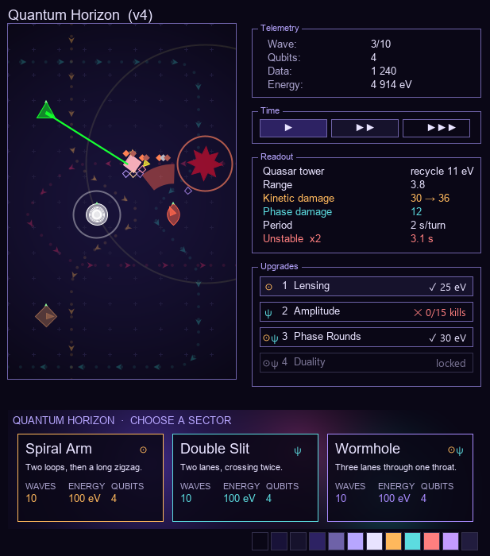

# Theme Brainstorm: Astral & Quantum

A proposal to give jTD a character: a science theme at the two extreme scales, the **astral**
(stars, gravity, light-years) and the **quantum** (particles, probability, entanglement), leaning
quantum, with sci-fi welcome wherever it plays better. It renames everything the player reads,
recolours a little, reshapes a few symbols, and changes no rules; section 11 adds optional
mechanics the theme suggests. Nothing here is decided.

**How to use it** (the same conventions as `towers-brainstorm.md`)

- `[x]` = keep it, `[ ]` = no, or not yet. Write anything after a 💬.
- ⭐ = my pick where options compete.
- Cost tags: 🟢 text or a constant · 🟡 one small new piece (a shape, a mark, a rule row) · 🔴 a
  new system.
- ☉ = astral and ψ = quantum, used throughout as the two scales' marks.
- In a hurry: sections 1, 2, 12, 13 and 17 (every decision in one list).

Contents: 1 The pitch · 2 Ground rules · 3 Setting and frame · 4 The two scales as a design grammar
· 5 Towers · 6 Upgrade trees · 7 Damage, stats and effects · 8 HUD, menus and levels · 9 Enemies
(draft) · 10 Visuals and UI · 11 Theme mechanics and decisions (optional) · 12 Impact assessment ·
13 For the better, for the worse · 14 Iteration 2 and the towers brainstorm · 15 Adoption tiers ·
16 Word bank · 17 Decisions · 18 Review notes and sources

---

## 1. The pitch

**Thesis: two scales, one language.** Everything the player meets belongs to the very large (☉),
the very small (ψ), or, rarely and on purpose, both. Three signals always agree: the **name** (a
body in the sky, or a particle or quantum effect), the **colour** (star gold or oxygen teal) and
the **mark** (☉, astronomy's sign for the Sun; ψ, physics' sign for a wavefunction). A tower's
home scale is its damage type, so its name tells the player the colour of its damage before they
read a number. One rule to learn, used everywhere: that is the uniform experience.

The lean is quantum where it shapes play most, in the rules: effects, stats and upgrade logic
speak of *states* (superposed, observed, coherent, unstable), and states are what rules are made
of. Astral words go where the eye lands first, on big recognisable objects: a comet, a pulsar, a
nova. The scales meet at a black hole, where physics needs both at once, so the bridge pieces (the
Singularity tower, Duality, the Wormhole level) are black-hole pieces.

**The fiction**, in four sentences. This is the whole lore budget; nothing in the game needs more.

> Near a black hole, the very large and the very small stop being separate. Your lab keeps a
> quantum core in orbit there, and something has torn the space beside the horizon: anomalies pour
> through the tear toward the core, particles that shouldn't exist and the debris of dying stars.
> Every anomaly that reaches the core decoheres one of its qubits; lose them all and the
> computation is gone. You hold the line with instruments that harness both scales.

**Why this theme fits jTD unusually well.** Most themes would be paint. This one names mechanics
the game already has:

| Already in the game                                                                    | Already is physics                                                                                                      |
|----------------------------------------------------------------------------------------|-------------------------------------------------------------------------------------------------------------------------|
| Two damage types, and Elite armor that resists whichever has landed most this level    | A duality: mix the two scales or the rift adapts                                                                        |
| Invisible: towers can't target it, area damage still reaches it; Revealed undoes it    | Superposition and observation: no definite position until measured, yet a field across the whole region still touches it |
| Chill slows and adds up; freezing a chilled enemy lasts longer by the chill's level    | Time dilation deepening into stasis, like falling toward a horizon                                                      |
| Sonar's beam sweeps around once every 2 s                                               | A pulsar, exactly                                                                                                       |
| Burn and poison are separate damage-over-time pools that stack                          | Two kinds of slow damage: stellar heat and radiation                                                                    |
| Waves                                                                                   | Already a physics word; it stays                                                                                        |
| The Warden dies into an egg that hatches a weaker Warden, twice                         | A star's death in stages: red giant, white dwarf, black dwarf, each smaller than the last                               |
| Reaver splits into two Simple mobs on death                                             | A meson is a pair of quarks                                                                                             |
| Black board, phosphor-green self-painted HUD                                            | Already reads as an instrument console                                                                                  |

It is also cheap. Board art is vector code keyed by colour roles in one class, every control
paints itself (so its look is colour constants, though today they sit in about ten classes), and
effect and stat labels each live in one switch. The theme is mostly words.

💬

---

## 2. Ground rules for the theme

- [ ] ⭐ **Play first, then feel, then science.** A name earns its place by hinting at what the
  thing does; then it should sound good aloud; real science is the seasoning, not the judge. Pop
  science and sci-fi tropes (cloaks, phase shifts, stasis fields, tachyons) are welcome wherever
  they play better than the textbook. The theme exists to make decisions readable and interesting.
  - 💬
- [ ] ⭐ **Rename what belongs to another genre; keep what already fits science.** Fantasy and
  military words go: Spirit, Hex, Curse, Aura, Awaken, Transcendent, Warden, Mender, Ghost, Grunt,
  Siege, Marksman, Warhead, Withering, Warding, Toxic Bloom, "mob". Science-ready words stay: Wave,
  Burning, Scorched, Shield, Plating, Resilience, Momentum, Range, Crit, Resonance. Fewer renames,
  same character.
  - 💬
- [ ] ⭐ **Clarity beats cleverness.** A themed effect keeps its plain meaning one click away: the
  inspector says "Dilated: slowed 40%", "Superposed: towers can't target it". Marker colours and
  glyphs don't change, so a returning player's eye still works.
  - 💬
- [ ] ⭐ **One word, one meaning.** The good quantum words are few (superposition, entanglement,
  coherence, observation, tunneling). Each is spent once, on the most visible thing it fits.
  Section 16 lists the words still unspent.
  - 💬
- [ ] ⭐ **Astral upgrades make a tower bigger; quantum upgrades make it stranger.** ☉ = more mass,
  reach, heat, area, raw power. ψ = chance, states, splitting in two, seeing the unseen, going
  through things. This is the lens for every node iteration 2 still has to write (section 4).
  - 💬
- [ ] ⭐ **One line of flavour at most.** No fake-science paragraphs. A name and its rule do the
  work.
  - 💬
- [ ] ⭐ **A tower's name is one short word that sounds good aloud**, from the sky, the particle
  zoo or a famous effect, and it follows the tower's damage type (section 5).
  - 💬
- [ ] **Two marks, two hues.** ☉ warm (star gold), ψ cool (oxygen teal), on a deep indigo base
  (section 10). Used for meaning only (damage type, a chain's scale), never to colour every object.
  - 💬

---

## 3. Setting and frame

| Today                                | ⭐ Themed                            | Alternatives                      | Why                                                                                    |
|--------------------------------------|-------------------------------------|-----------------------------------|----------------------------------------------------------------------------------------|
| "Tower Defense" (window, title)      | **Quantum Horizon**                 | Planck & Parsec; Event Horizon; Rift | quantum first (the lean), horizon for the black hole. A search found no game by that name, while "Event Horizon" is a film and several games. "Planck & Parsec" names the two extremes but is harder to say |
| enemies, "mob"                       | **anomalies**                       |                                   | neither scale owns the word                                                            |
| Lives                                | **Qubits**                          | Containment, Integrity            | a count that reads naturally ("Qubits: 5"); quantum computing in one word              |
| Cash / credits, `$35`                | **Energy**, written `35 eV`         | Quanta (`ħ 35`)                   | a destroyed anomaly releases its energy; `eV` reads as a unit like `$`                 |
| Score                                | **Data**                            | keep Score                        | the lab collects observations                                                          |
| Bounty                               | **Yield**                           |                                   | an anomaly's energy yield                                                              |
| Sell                                 | **Recycle**                         | Dismantle                         | energy comes back                                                                      |
| "Killed" (inspector)                 | **Annihilated**                     | Destroyed                         | the strongest word for "gone completely"                                               |
| "Leaked"                             | **Breached**                        | Reached core                      |                                                                                        |
| "Game Over!"                         | **Decoherence**                     | Core lost                         | all qubits gone                                                                        |
| "Congratulations!"                   | **Horizon held**                    | Rift sealed                       | echoes the title                                                                       |
| Wave                                 | **Wave** (keep)                     |                                   | already physics                                                                        |
| tower (the generic word)             | **tower** (keep)                    | instrument                        | genre clarity: "Quasar tower" says what you're buying                                  |
| level                                | **sector** on the title screen      | keep level                        |                                                                                        |

- [ ] ⭐ Keep the word "tower". The shop and panels say "Quasar tower"; only the fiction calls them
  instruments.
  - 💬

---

## 4. The two scales as a design grammar

|                 | ☉ Astral, the very large                              | ψ Quantum, the very small                                         |
|-----------------|-------------------------------------------------------|-------------------------------------------------------------------|
| Feels like      | mass, gravity, heat, distance, time                   | chance, states, links, barriers that aren't there                 |
| Upgrades do     | more damage, area, range and heat; slow and stop      | crit, two-at-once, reveal, through armor and shields, links       |
| Damage type     | Kinetic                                               | Phase                                                             |
| Damage over time| Burning (stellar heat), leaving Scorched              | Irradiated (decay), leaving Decohered                             |
| Control         | Dilated, then in stasis                               | Superposed and Observed; Unstable                                 |
| Name sources    | bodies and events in the sky, astronomy               | particles, quantum effects, quantum computing                     |
| Towers at home  | Quasar, Nova, Pulsar, Comet (kinetic)                 | Tachyon, Photon (phase), Entangler (support)                      |

**Every tower has a home scale and picks a lean.** Its home scale is its damage type, which its
name follows (section 5). Its lean is its head chain: each tower's two exclusive chains already
split cleanly, one ☉ and one ψ (table in 6.2), so choosing a chain becomes choosing a lean, and the
panel can say so with a mark. A kinetic Quasar can lean quantum. Nothing in the rules changes.

- [ ] ⭐ 🟢 Head chain A / B = ☉ / ψ on every tower, marked in the upgrade panel.
  - 💬
- [ ] ⭐ 🟡 The tower shows its chosen scale on the board too: its head pips take the chain's gold
  or teal. Each slot has its own row of pips, so the row already says which slot and colour is
  free to say which scale (section 10's palette rules).
  - 💬
- [ ] ⭐ Iteration 2's **extra head node** (exclusive with nothing) is where a tower borrows from
  its *other* scale, for example a kinetic Quasar's Phase Rounds (every Nth shot deals phase). It
  carries both marks.
  - 💬
- [ ] ⭐ **Transcendent becomes Duality**: the tower holds two specials at once. Iteration 2 wants
  the two to affect each other; the theme calls each special pairing an **interference pattern**.
  - 💬

---

## 5. Towers

| Today  | ⭐ Themed        | Home scale         | Why it fits                                                                                                                                                                | Symbol (one closed shape)                                    | Alternatives                                                        |
|--------|-----------------|--------------------|----------------------------------------------------------------------------------------------------------------------------------------------------------------------------|--------------------------------------------------------------|---------------------------------------------------------------------|
| Sniper | **Quasar**      | ☉ kinetic          | the brightest objects in the universe, some firing jets across intergalactic space: long range, one target, huge hits. Its hotkey is already `q`                              | a dot with two opposite thin jets                            | Railgun (sci-fi), Lancer                                            |
| Splash | **Nova**        | ☉ kinetic          | a star's sudden flash: a burst at one point, cheap and frequent                                                                                                            | a four-point sparkle                                         | Positron ψ, if Splash turns phase (brainstorm 3.2 B)                |
| Sonar  | **Pulsar**      | ☉ kinetic          | a spinning neutron star sweeping its beam like a lighthouse: the tower's exact mechanic. "Rotation" becomes "Period", the number astronomers quote for a pulsar               | a small disc; the sweeping head is the beam                  | Lighthouse                                                          |
| Pulse  | **Singularity** | ☉ψ, either damage  | a tiny black hole that hurts everything near it, the unseen too. The brainstorm's Pulse ideas (pull, slowing inside, debuffs lasting longer inside, Event Horizon) are black-hole ideas already | a thin bright ring around a dark centre                      | Black Hole, Gravity Well                                            |
| Aura   | **Entangler**   | ψ (no damage)      | links nearby towers so they act as one; the faint lines it already draws to them read as entanglement                                                                      | two interlocked rings                                        | Ansible (sci-fi's instant link), Gluon (the particle named after glue) |
| Mortar | **Comet**       | ☉ kinetic          | a slow lob with a tail; comets are ice and dust, so its chill explains itself                                                                                              | a disc with a tapered tail; the shell matches                | Mass Driver, Orbital Strike (sci-fi)                                |
| Seeker | **Tachyon**     | ψ phase            | the faster-than-light particle of sci-fi: it arrives before it's fired, so it never misses                                                                                 | keep the kite                                                | Positron                                                            |
| Cinder | **Photon**      | ψ phase            | a particle of light: Cinder's cone becomes a cone of light hot enough to burn                                                                                              | a wave packet (the squiggle physicists draw for a photon), or keep the flame | Flare ☉, Plasma Torch (sci-fi)                                      |

**The home-scale rule.** A tower's name belongs to the scale of its damage: kinetic towers are
bodies in the sky, phase towers are particles. The player learns a tower's damage colour from its
name. The Singularity, the bridge piece, fits either way, so its name doesn't pre-empt the
brainstorm's question whether Pulse should deal phase (1.3). Nova turns into Positron only if
Splash turns phase.

**Does the name hint at the job?** (play first)

| Tower       | Hint                                     | Verdict                                                  |
|-------------|------------------------------------------|----------------------------------------------------------|
| Quasar      | far and powerful                         | partly: "long-range sniper" needs the silhouette's jets  |
| Nova        | a burst                                  | yes                                                      |
| Pulsar      | spinning beam                            | yes, for anyone who has heard of one; the sweep teaches the rest |
| Singularity | everything near it is pulled and crushed | yes                                                      |
| Entangler   | links                                    | yes                                                      |
| Comet       | slow, lobbed, icy                        | yes                                                      |
| Tachyon     | fast, can't miss                         | yes                                                      |
| Photon      | light                                    | partly: the cone and the burn need the art               |

- [ ] ⭐ **The roster above**: four ☉, three ψ, one both. The name predicts the damage colour.
  - 💬
- [ ] **Flare for Cinder** (the first draft): a vivid picture of a burst of fire, but an astral
  name on a phase-damage tower, so the name stops predicting the colour, and the board leans astral
  five to two on a quantum-leaning brief.
  - 💬
- [ ] **Sci-fi tech names**: Railgun, Nova, Pulsar, Gravity Well, Ansible, Mass Driver, Tachyon,
  Plasma Torch. Clearer about each job, but the board then reads as hardware rather than the two
  scales, and the home-scale rule loses its anchor.
  - 💬

**Look-alike names.** Pulsar and Quasar rhyme; Pulsar and Photon share a first letter. Each pair
behaves oppositely (sweeps or aims; kinetic or phase), and the toolbar shows shapes, not names, so
the cost is small. 💬

**Tower sheet rows**: Physical damage → **Kinetic damage**; Magic damage → **Phase damage**;
Rotation → **Period**; Splash radius → **Blast radius**. Range, Fire rate, Crit chance, Targets,
Kills and Damage dealt stay.

---

## 6. Upgrade trees

32 names ship today: 2 base nodes, 16 head chains, 14 specials. Every one is renamed or
deliberately kept below.

### 6.1 The base slot

| Today                                  | ⭐ Themed          | Scale | Why                                                                                         |
|----------------------------------------|-------------------|-------|---------------------------------------------------------------------------------------------|
| Range (and iteration 2's II and III)   | **Aperture I-III** | ☉     | a bigger telescope sees further. The stat itself stays "Range"                              |
| Fortify (working name)                 | **Grounding**     | ψ     | grounds out interference: its brainstorm job is jam-proofing, and the Jammer becomes a Magnetar |
| Awaken                                 | **Excitation**    | ψ     | lifts the tower to a higher energy level; unlocks head III and the special                  |
| Transcendent                           | **Duality**       | ☉ψ    | two natures at once: the second special and head IV                                         |

Ground, excited, dual reads as one ladder. It also settles the brainstorm's complaint (9.5) that the
chain mixed an engineering word with two spiritual ones.

- [ ] ⭐ Aperture · Grounding → Excitation → Duality.
  - 💬
- [ ] Shielding → Coherence → Superposition. Clearer as quantum computing (shield the qubit, make
  it coherent, superpose it), but "Superposition" collides with Superposed (7.3) and "Coherence"
  with the stat (7.2).
  - 💬
- [ ] Slot names BASE / HEAD / SPECIAL: ⭐ keep (structural words that suit any theme), or SPECIAL
  → Anomaly.
  - 💬

### 6.2 Head chains: one ☉, one ψ per tower

| Tower       | ☉ chain (today → themed)                                      | ψ chain (today → themed)                                                      |
|-------------|---------------------------------------------------------------|-------------------------------------------------------------------------------|
| Quasar      | Focused Optics → **Lensing**                                  | Marksman's Eye → **Amplitude** (a crit is a probability)                      |
| Nova        | Blast Engineering → **Shockfront**                            | Rapid Battery → **Cascade** (a particle shower)                               |
| Pulsar      | Long Reach → **Parallax** (how astronomers measure distance)  | Twin Array → **Beam Splitter** (one beam, two paths)                          |
| Singularity | Overcharged Coils → **Accretion**                             | Resonant Field → **Observer Effect** (touches and reveals the superposed)     |
| Entangler   | Resonance Field → **Gravity Reach**                           | Amplifying Core → **Coupling**                                                |
| Comet       | Siege Rounds → **Impactor**                                   | Fragmentation Rounds → **Fission**                                            |
| Tachyon     | Twin Warhead → **Binary**                                     | Deep Freeze → **Zeno Lock** (a system watched closely can't change)           |
| Photon      | White Flame → **Fusion** (how stars make their light)         | Wide Nozzle → **Dispersion** (light spreading out, as in a prism)             |

Every pair fits its lens with no content change: the ☉ chains are raw power, area, reach and heat;
the ψ chains are crit, reveal, stasis, splitting and spreading. It also ends the Resonant Field /
Resonance Field near-duplicate (brainstorm 9.5).

The 32 themed names average 9.9 characters against today's 12.3 and none is longer than 15, so
the narrow upgrade buttons cut fewer names short than they do now ("Fragmentation Rounds II").

Still true after renaming: some level Is don't deliver their name (Beam Splitter I is +25% damage,
Binary I is fire rate, Zeno Lock I is damage). That is the content fix in brainstorm 9.4, not a
naming one; the themed names are vaguer, so they promise less.

- [ ] ⭐ The table above.
  - 💬

### 6.3 Specials

| Tower       | Today            | ⭐ Themed              | Why                                                                     |
|-------------|------------------|-----------------------|-------------------------------------------------------------------------|
| Quasar      | Marked Round     | **Destabilizer**      | applies Unstable; the old name clashed with Mark on Sweep               |
|             | Fifth Shot       | **Fifth Harmonic**    | keeps the "fifth" that explains it                                      |
|             | Momentum         | **Momentum** (keep)   | already physics                                                         |
| Nova        | Toxic Bloom      | **Fallout**           | applies Irradiated                                                      |
|             | Concussive Blast | **Supernova**         | kills explode; a nova's big sibling                                     |
|             | Overpressure     | **Gamma Burst**       | after a crit, the next shot hits everything in range                    |
| Pulsar      | Wide Band        | **Sky Survey**        | each revolution observes every superposed anomaly it passes             |
|             | Mark on Sweep    | **Collapse**          | collapses chance into certainty: the next hit crits                     |
|             | Piercing Tone    | **Tunneling**         | its bonus goes through armor and shields                                |
| Singularity | Warding Field    | **Tidal Stress**      | applies Unstable, and no longer sounds protective                       |
| Entangler   | Withering Field  | **Instability**       | enemies in range turn Unstable                                          |
| Comet       | Cursed Shrapnel  | **Volatile Core**     | comets are made of volatiles                                            |
| Tachyon     | Homing Curse     | **Paradox**           | a hit that breaks cause and effect leaves the target Unstable           |
| Photon      | Hexflame         | **Ionizer**           | ionizing light leaves atoms unstable: a new ignition applies Unstable   |

The six Vulnerable-applying specials lose their hex, curse and mark words (brainstorm 9.5). They
still all apply the same debuff: the theme renames the duplication in brainstorm 1.4, it doesn't
fix it. Its payload swaps get themed names in section 14.

- [ ] ⭐ The table above.
  - 💬

---

## 7. Damage, stats and effects

### 7.1 Damage types

| Today    | ⭐ Themed    | Scale | Reads as                                  |
|----------|-------------|-------|-------------------------------------------|
| Physical | **Kinetic** | ☉     | mass and momentum; plating stops it       |
| Magic    | **Phase**   | ψ     | phases through plating                    |

- [ ] ⭐ Kinetic / Phase.
  - 💬
- [ ] Kinetic / Quantum: more on the nose, but "quantum" would then mean a damage type *and* a
  chain's scale.
  - 💬
- [ ] Particle / Wave: the famous duality, but "wave damage" collides with enemy waves.
  - 💬
- [ ] Kinetic / Energy: plain sci-fi, but collides with Energy the currency.
  - 💬

Adaptive elite armor is the theme's synergy rule, already shipped: *Elite anomalies adapt to
whichever of kinetic and phase has landed most, so mix the scales.* Only its text changes. The
`armored` spawn shape keeps its wave-script keyword; its description says kinetic.

### 7.2 Enemy stats in the inspector

| Today                                         | ⭐ Themed                      | Note                                                                     |
|-----------------------------------------------|-------------------------------|--------------------------------------------------------------------------|
| Resist physical / magic, Weak to ...          | Resist kinetic / phase        | follows the damage words                                                 |
| Plating, physical / magic                     | Plating, kinetic / phase      |                                                                          |
| Spirit                                        | **Coherence**                 | scales heals and shields and how fast stacks wear off; at -100 an anomaly is fully decohered |
| Stealthed                                     | **Superposed**                |                                                                          |
| Resilience, Speed, Regenerates, Crit chance taken | keep                      | neutral words                                                            |

### 7.3 Effects

| Today     | Kind        | ⭐ Themed            | Scale | The inspector's plain line                                  |
|-----------|-------------|---------------------|-------|-------------------------------------------------------------|
| Chilled   | soft CC     | **Dilated**         | ☉     | slowed by its depth, never past 80%                          |
| Freeze    | hard CC     | **In stasis**       | ☉     | stopped. The ice-crystal art stays: cryostasis              |
| Burning   | DoT         | **Burning** (keep)  | ☉     | stars burn                                                  |
| Poisoned  | DoT         | **Irradiated**      | ψ     | its own pool; slows a little                                |
| Scorched  | debuff      | **Scorched** (keep) | ☉     | resilience down                                             |
| Sickened  | debuff      | **Decohered**       | ψ     | coherence down (stacks, like Scorched)                      |
| Vulnerable| debuff      | **Unstable**        | ψ     | takes more damage                                           |
| Shield    | restorative | **Shielded** (keep) |       |                                                             |
| Heal      | restorative | **Restoring**       |       | anomalies don't heal, they restore                          |
| Invisible | stealth     | **Superposed**      | ψ     | towers can't target it; area damage still reaches it        |
| Revealed  | stealth     | **Observed**        | ψ     | towers can target it again                                  |

The existing rules read as physics once renamed:

- Stasis on a Dilated anomaly uses the dilation up and lasts longer by it: time slowing until it
  stops.
- Dilation cuts burning damage: slower time, slower fire.
- Stasis puts the fire out but keeps Scorched.
- Burning (heat, ☉) and Irradiated (decay, ψ) are separate pools that stack: one fire for each
  scale.
- Superposed anomalies dodge every aimed shot but not a field over the whole region.

**Effect families.** A cause and its result share a word family, so they read as one: Observer
Effect and Sky Survey leave anomalies Observed; Fallout leaves them Irradiated; Zeno Lock puts
them in stasis; Destabilizer, Tidal Stress, Instability, Volatile Core, Paradox and Ionizer leave
them Unstable; Collapse leaves them Measured (the brainstorm's Marked, section 14). A concept may
appear on both sides of the board when it means the same thing: an anomaly is Decohered, the
core's loss is Decoherence.

- [ ] ⭐ Time words: Dilated and In stasis.
  - 💬
- [ ] Cold words: keep Chilled and Frozen. The most legible, and Comet's chill fits them, but it
  loses the slow-then-stop story.
  - 💬
- [ ] ⭐ Superposed and Observed for stealth: the theme's best idea, explained by the plain line.
  - 💬
- [ ] Sci-fi stealth words: **Cloaked** and **Scanned**. Every gamer reads them instantly; the
  quantum lean loses its signature rule.
  - 💬

---

## 8. HUD, menus and levels

| Where                    | Today                                              | ⭐ Themed                                                         |
|--------------------------|----------------------------------------------------|------------------------------------------------------------------|
| Window title             | Tower Defense v1.4                                 | Quantum Horizon v1.4                                             |
| Title screen             | TOWER DEFENSE · SELECT YOUR LEVEL · CLICK TO DEPLOY | QUANTUM HORIZON · CHOOSE A SECTOR · CLICK TO DEPLOY (keep)       |
| Level card               | WAVES · CREDITS · LIVES                            | WAVES · ENERGY · QUBITS                                          |
| Status panel             | Status: Wave, Lives, Score, Cash                   | Telemetry: Wave, Qubits, Data, Energy                            |
| Speed panel              | Speed: ► ►► ►►►                                    | **Time**: ► ►► ►►► (the player literally dilates it)             |
| Info panel               | Info                                               | Readout                                                          |
| Shop / upgrades / waves  | Towers · Upgrades · Current & Next Wave            | keep                                                             |
| Sell button              | Sell ( $11 )                                       | Recycle (11 eV)                                                  |
| Every price              | $35                                                | 35 eV                                                            |
| Overlays                 | Game Over! · Congratulations! · Back to menu       | Decoherence · Horizon held · Back to menu                        |

**Levels**

| Today             | ⭐ Themed        | Scale | Why                                                                                            |
|-------------------|-----------------|-------|------------------------------------------------------------------------------------------------|
| Curly Path        | **Spiral Arm**  | ☉     | a lane that spirals through two tight loops: a galaxy's arm                                    |
| Zigzag Path       | **Double Slit** | ψ     | two lanes, one crossing the other twice: the experiment where a particle seems to take both paths at once |
| Twisted Hourglass | **Wormhole**    | ☉ψ    | three lanes through a pinched waist: the classic wormhole drawing is two funnels joined at a throat, and Wheeler named it for that shape |

- [ ] ⭐ The three level names.
  - 💬
- [ ] Level descriptions call lanes **worldlines**.
  - 💬

---

## 9. Enemies (a draft, for the enemy iteration)

Enemies are yours to redo after the towers, so this is only the grammar and a first mapping, good
enough that a renamed game isn't left with "Simple mob" in it. **Grammar:** ψ for particles and
quantum processes (plain, small, strange or repairing anomalies); ☉ for bodies (heavy, big or
disruptive ones); the boss is a star's death in stages.

| Today                                 | Draft                                     | Scale | Why                                                                                                     |
|---------------------------------------|-------------------------------------------|-------|---------------------------------------------------------------------------------------------------------|
| Simple                                | **Quark**                                 | ψ     | the basic building block                                                                                 |
| Armored                               | **Asteroid**                              | ☉     | rock: armour, and no weak spot to crit                                                                   |
| Frenzied                              | **Sungrazer**                             | ☉     | a comet diving at the Sun: faster as it falls, shedding itself as it goes (Meteor works too)            |
| Frenzy Spawnling                      | **Fragment**                              | ☉     | sungrazers break into pieces near the Sun                                                               |
| Ghost                                 | **Neutrino**                              | ψ     | nicknamed "the ghost particle": trillions pass through you every second unnoticed                       |
| Mender                                | **Nebula**                                | ☉     | a stellar nursery: things near it grow back                                                             |
| Jammer                                | **Magnetar**                              | ☉     | the strongest magnets known: its field wrecks instruments, and Grounding answers it                     |
| The Warden / Weakened / Exhausted     | **Red Giant / White Dwarf / Black Dwarf** | ☉     | a star's death in stages, each smaller than the last (no black dwarf exists yet: the universe is too young to have cooled one) |
| the egg                               | **Remnant**                               | ☉     | what a dying star leaves behind, still glowing, ready to flare up again                                 |
| Reaver                                | **Meson**                                 | ψ     | a pair of quarks: destroyed, it splits into two Quarks                                                  |
| Empty (spacer)                        | **Vacuum**                                |       |                                                                                                         |

- [ ] ⭐ Rename enemies with these drafts in the same pass as everything else, so no "mob" survives,
  and redo them in the enemy iteration.
  - 💬
- [ ] ⭐ Ranks Grunt / Soldier / Veteran / Elite / Boss → energy classes **keV / MeV / GeV / TeV /
  PeV**, the prefixes physicists use for particle and cosmic-ray energies. Everyone knows kilo <
  mega < giga < tera < peta from file sizes, so the order needs no teaching, it sounds like an
  arcade's power ladder, and it ties rank to Yield, which already rises with rank. The Boss
  badge's skull → a horizon mark (a dark disc with a bright rim).
  - 💬
- [ ] Ranks as words: Trace / Stable / Heavy / Exotic / Prime. Their order has to be learned.
  - 💬

**The brainstorm's enemy ideas (section 5), themed**: Blinker (teleports forward when hit) →
**Tunneler** ψ · Burrower (untargetable, hurt only by fields and ground effects) → **Dark Matter**
☉, felt only through gravity · Priest (cleanses allies' debuffs) → **Corrector** ψ (quantum error
correction wipes out errors) · Juggernaut (huge plating) → **Neutron Star** ☉ · Mites → **Cosmic
Dust** ☉ · Courier → **Muon** ψ (fast and short-lived) · Shieldbearer → **Magnetosphere** ☉ ·
Drummer (haste aura) → **Accelerator** ψ · Salamander (burn-immune) → **Sunspot** ☉ · Yeti
(freeze-immune) → **Ice Giant** ☉ · Necromancer → **Recombiner** ψ · Mirror (resists the last type
it took) → **Antiparticle** ψ · Elite affixes → **exotic properties**.

**New enemy ideas the theme suggests** (each asks the player a question)

- [ ] ⭐ 🟡 **Phase Shifter** (sci-fi): flips every few seconds between immune to kinetic and immune
  to phase, with a visible tell before each flip. *Which towers fire when?* It makes the
  kinetic/phase mix a timing decision, not just a ratio.
  - 💬
- [ ] 🟡 **Bell Pair** (the textbook entangled pair): two anomalies in one shared state; destroy
  either and the other collapses at the same instant. *Kill the easy one or the dangerous one?*
  Focus fire suddenly pays twice.
  - 💬
- [ ] 🟡 **Virtual Pair**: two anomalies pop into existence mid-path and annihilate each other after
  a few seconds, unless one is killed first, which makes the other real and permanent. *Leave them
  alone?* The rare enemy you should not shoot.
  - 💬
- [ ] 🟡 **Unobserved**: invisible everywhere except inside a Pulsar's range. *Where do the Pulsars
  go?* Gives the Pulsar a job in every level.
  - 💬
- [ ] 🔴 **Schrödinger**: drawn at two points of the path at once; the first hit collapses it into
  that one. *Hit it early, at the safe copy, or let it come?*
  - 💬

---

## 10. Visuals and UI

### Is an overhaul necessary?

**No.** The layout stays. Its colours change: the black-and-green instrument console becomes
deep-space indigo with gold and teal accents (the palette below), but that is constants, not
structure. Every control already paints itself (its colours sit in about ten classes today, see
the cost note below), every board colour and shape lives in `Java2DFrameRenderer` behind a
`Palette` role, and the toolbar icons reuse the board shapes. The theme needs labels, a handful of colours and five
silhouettes, not a new UI.

What to do instead, highest value per cost first:

1. [ ] ⭐ 🟢 **Labels and the title** (sections 3 and 8).
   - 💬
2. [ ] ⭐ 🟢 **☉ / ψ marks** next to chain names in the upgrade panel. They double as iteration 2's
   exclusive-choice mark for the two chains: the choice reads "☉ or ψ".
   - 💬
3. [ ] ⭐ 🟢 **Recolour only what the new names contradict**: Comet brown → ice white-blue (body and
   shell); Singularity orange → gold ring around a dark centre; Entangler white → oxygen teal, its link
   lines too. Everything else keeps its colour, so the board still reads the same.
   - 💬
4. [ ] ⭐ 🟡 **New silhouettes** for Quasar, Nova, Singularity, Entangler and Comet (section 5),
   one closed shape each as the render rules require. The toolbar follows for free.
   - 💬
5. [ ] 🟡 **A backdrop.** [ ] ⭐ the deep-field gradient plus faint **tick marks** (a tiny +) at
   the corners of buildable cells: a "spacetime grid" that is theme *and* shows where you can build
   / [ ] a dim starfield / [ ] none. Full lattice lines were tried and drowned the path dots; a
   starfield of dots would camouflage the dotted path the same way. Both are static, so they're
   painted once per level and stay out of the per-frame budget.
   - 💬
6. [ ] 🟡 **Path ends**: a swirl where anomalies enter (the tear) and a core mark where they
   leave.
   - 💬
7. [ ] 🟡 **Projectile tails**: a comet tail on the shell, a streak behind the tachyon. Needs each
   shot's heading when it's drawn.
   - 💬
8. [ ] ⭐ 🟢 **The deep-space palette** below: indigo and violet instead of phosphor green.
   - 💬

### The palette: the Hubble palette on a deep field

**The idea in one line:** an indigo deep field, violet chrome as the game's "space" voice, and
meaning carried by **gold ☉ and teal ψ**, which is the signature of the Hubble narrowband palette.
It maps sulfur light to red, hydrogen to green and oxygen to blue, so gas rich in sulfur and
hydrogen comes out gold and oxygen-rich gas teal-blue (the Pillars of Creation look). The UI's two
scales wear the colours of some of the most famous space images ever made.

**Loudness follows information density.** The title screen is loud (a nebula), the HUD is medium
(violet chrome, quiet surfaces), and the board is the quietest (a deep field you feel rather than
see). The board is where the player reads the game, so decoration stays out of its way.

Measured, not eyeballed: WCAG contrast, CIELAB lightness and chroma, ΔE2000 colour distance,
colour-blind simulation (Machado 2009, full severity), and a clash check against every colour the
board already draws. The mock render is at the end of this subsection.

| Role                          | Today                 | ⭐ Proposed                   | Hex       | Contrast on deep field | Where                                                        |
|-------------------------------|-----------------------|------------------------------|-----------|------------------------|--------------------------------------------------------------|
| Deep field                    | black                 | near-black indigo            | `#0A0716` | (base)                 | window, panels, board edges                                  |
| Board centre                  | black                 | deep indigo, radial to edges | `#181238` | 1.12                   | a static gradient under the board: felt, not seen            |
| Raised                        | black                 | dark indigo                  | `#16122C` | 1.10                   | hover, level cards (85% opaque over the nebula), bar tracks  |
| Selected / pressed            | dark green            | deep violet                  | `#2D2263` | 1.44                   | selected toggle, pressed button                              |
| Border                        | `#4E684E` (3.41)      | dusky violet                 | `#6E62A8` | **3.77**               | every panel and control outline                              |
| Border, disabled              | `#303C30`             | faint indigo                 | `#332F4C` | 1.57                   | disabled controls (exempt)                                   |
| Panel titles                  | pale green            | **nebula violet**            | `#B7A6FF` | 9.40                   | "Telemetry", "Readout"…: the HUD's space voice               |
| Text and values               | `#DCFFDC`             | starlight                    | `#E8E3FF` | 15.99                  | everything read first, numbers included                      |
| Labels                        | `#AACDAA`, `#96AA96`  | lavender grey                | `#A9A2CC` | 8.27                   | "Wave:", stat names, prose                                   |
| Disabled text                 | `#607060`             | muted lavender               | `#7B7596` | 4.58                   |                                                              |
| **☉ astral**                  | `#E69646` (physical)  | star gold                    | `#FFB85C` | 11.62                  | kinetic damage, ☉ marks, head pips of a ☉ chain              |
| **ψ quantum**                 | `#5ABEFF` (magic)     | oxygen teal                  | `#5CDCE0` | 12.10                  | phase damage, ψ marks, head pips of a ψ chain                |
| Problem                       | `#FF7878`             | rose                         | `#FF7F7F` | 8.15                   | unmet gate (with ✕), can't afford, Breached                  |
| Special pips                  | `#C864FF`             | lavender violet              | `#C49BFF` | 8.99                   | special slot pips and halo                                   |
| Lattice ticks                 | (none)                | faint indigo                 | `#211C3E` | 1.23                   | tiny + at cell corners, buildable cells only                 |
| Title-screen nebula           | (none)                | violet, hydrogen pink, oxygen teal | `#3F2A85`, `#5A2150`, `#12505A` | glow peaks | soft glows behind the level cards                            |

**Rules that come with it**

- [ ] ⭐ **Only gold, teal and rose mean something.** Everything else is chrome (violet, starlight)
  or identity (tower, enemy, lane and effect colours, which stay as they are, so nobody relearns
  the board).
  - 💬
- [ ] ⭐ **Good news needs no colour.** A met gate is starlight with ✓ and an improvement is
  starlight with →; only a problem is coloured (rose with ✕). That frees green entirely, and
  green is the colour least at home in an indigo scheme.
  - 💬
- [ ] ⭐ **Both scales show both marks.** Duality and the extra head node show ☉ in gold and ψ in
  teal side by side, never a third "both" colour.
  - 💬
- [ ] ⭐ **Pip colour says scale, not slot.** Each slot has its own row of pips, so the row already
  says which slot. Colour is then free to say which scale: base pips starlight, head pips the
  chosen chain's gold or teal, special pips lavender violet. This also ends a collision: today's
  gold head pip is almost exactly ☉ gold (ΔE 9).
  - 💬
- [ ] ⭐ **Board chrome follows**: placement highlight and the range ring turn lavender (today
  grey and cream); the health bar becomes a starlight fill on a raised track (today green).
  - 💬
- [ ] Level accents: Spiral Arm gold, Double Slit teal, Wormhole violet with a two-colour ☉ψ.
  - 💬

**What the measurements say**

- ☉ against ψ: ΔE 42.6 in normal vision, and still 33 (protan), 40 (deutan) and 53 (tritan).
  Clearly distinct for every type of colour vision, and the ☉/ψ glyphs back it up anyway.
- Every text colour is at least 11:1 on every surface. Borders reach 3.77:1, better than today's
  green (3.41). Disabled text is 4.58:1. Gold and teal stay at least 8:1 on every surface; rose is
  5.65:1 at worst (on the selected fill).
- Inside a level card at the nebula's brightest point, text reads 15:1 and labels 7.8:1. Without
  the card fill, labels fell to 2.1:1.
- Path markers are alpha-blended, so they keep their contrast on a lighter field. Opaque dark
  pieces don't:

  | Board background        | Path chevron | Mortar brown | Warden red | Chill marker |
  |-------------------------|--------------|--------------|------------|--------------|
  | black (today)           | 3.55         | 3.60         | 2.10       | 5.93         |
  | `#181238` ⭐ centre      | 3.67         | 3.04         | 1.77       | 5.01         |
  | `#22184C` richer        | 3.57         | 2.76         | 1.61       | 4.55         |
  | `#2A1E5C` too rich      | 3.45         | 2.50         | 1.46       | 4.12         |

  - [ ] ⭐ `#181238` now. [ ] `#22184C` for a richer board once Comet (ice white) and the boss
    are recoloured.
    - 💬
- **A bug the theme can fix:** today's Warden red (`#8B0000`) is under 2.1:1 on *any* dark
  background, so the boss is the hardest thing on the board to see. A Red Giant in bright
  red-orange (`#FF6B4A`, 7:1) fixes it. That's for the enemy iteration; mind that it then sits
  close to Cinder's orange (ΔE 6), so the Photon should move toward a whiter, yellower light.
- **Known compromises:** to deuteranopes, the violet titles sit closer to ψ teal (ΔE 12). Titles
  are positional chrome, so that's acceptable. ψ teal is near the Simple enemy's cyan (ΔE 8),
  which the enemy iteration can revisit. ☉ gold equals Twisted Hourglass's amber lane, which is
  harmless because lanes carry no meaning.

**The science, honestly.** Deep space isn't purple. A true-colour photo of the sky is near-black,
with pink hydrogen glow and teal oxygen glow where gas shines. So the base stays almost neutral
(chroma 8: it reads as night, not as synthwave). Saturated violet appears only as chrome and in
the title-screen nebula, where hydrogen pink and oxygen teal glow as they do in real emission
nebulae. Gold and teal for the two scales are an imaging convention, but a real one.

**How it got here.** Four rounds, each measured and rendered:

- **v1**: indigo everywhere, violet borders, two tones per scale, magenta as the second ψ tone.
  Rejected. Borders fell to 2.1:1 (below today's green). Full lattice lines drowned the path dots
  (1.09:1 against them). Magenta collided with the special pips (ΔE 4) and the Jammer's pink. The
  rose second ☉ tone collided with the unmet-gate red. Saturated surfaces read as a purple slab.
- **v2**: quiet slate-indigo, a tick lattice, one tone per scale, uncoloured met gates. Legible,
  but it lost the space feel this palette exists for.
- **v3**: violet put back where it costs nothing (titles, selected state, the deep-field gradient,
  the title-screen nebula). Two problems remained: card labels over the nebula failed (2.1:1),
  and values were dimmer than their labels.
- **v4** (this table): filled cards, values brightest, ☉ψ in two colours everywhere.

**Cost, corrected.** The green does not live in `Hud` alone. It is about 50 colour literals across
about ten classes: `Hud`, the console, tower info, wave info, upgrade tree, wave rows, enemy
preview, level select, overlays and the info sheet's text and bar colours, plus the board
background and cell highlights in `Java2DFrameRenderer`. Gathering them into one HUD palette is
the natural first step. The deep-field gradient and the title nebula are static, so they're
painted once into a cached image, never per frame.

*The mock is today's board render composited onto the new base, beside a hand-drawn HUD and title
screen. It shows colours, not final layout.*

How far to take it:

- [ ] ⭐ **Everywhere**: board, HUD, buttons, level select, overlays. One look.
  - 💬
- [ ] **Board and menus only**: keep the green HUD, but the board gets the deep field and the
  level select the nebula. Cheaper, but two looks side by side.
  - 💬
- [ ] **Accents only**: keep black and green, use gold and teal just for meaning. The smallest
  change and the least "space".
  - 💬

Once implemented, confirm with a `PreviewBoard` render (board) and one `run-jtd` screenshot
(panels): Java2D's antialiasing and the real fonts differ slightly from the mock.

**Already in place, nothing to do:** physical damage already shows warm orange in the info sheet;
every effect marker already fits its themed name (Dilated blue, Stasis ice, Irradiated
yellow-green, Unstable pink, Observed violet), and Superposed is the existing body fade.

**Not recommended:** custom fonts (an asset to bundle and license), glow, bloom or CRT scanlines
(Java2D blur fights the 1 ms frame budget and adds no meaning), animated backgrounds.

### Vector or raster?

You don't insist on vector, so this is a real choice.

- [ ] ⭐ **Stay vector for every game piece.** Shapes scale with each level's cell size, recolour
  by role, stay in sync with the toolbar icons, and need no art pipeline and no licences. The place
  a raster image would add most is the backdrop, and a procedural lattice or starfield gets most of
  that for free.
  - 💬
- [ ] Allow exactly one raster asset: a nebula backdrop per level. The first image asset in the
  project, so the "no image assets" statements in `README.md` and `docs/ARCHITECTURE.md` change.
  - 💬

### Glyph risk

ψ is Greek and in every common font. ☉ is not guaranteed: the HUD uses Java's logical "Dialog"
font, whose fallbacks differ per OS, and the UI rule is one look on every OS. Either check a
screenshot on each OS, or paint ☉ as a tiny vector mark (a circle with a dot). The same goes for
`ħ` if the currency becomes Quanta.

---

## 11. Theme mechanics and decisions (optional)

The theme's job in play is to make decisions readable and to suggest new ones. Each item names the
decision it gives the player. Two exist already; the rest are optional, cost-tagged, and each would
be its own feature request.

1. [ ] ⭐ 🟢 **Mix the scales** (already shipped): adaptive elite armor resists whichever of kinetic
   and phase has landed most. *How much of each?* The theme only has to say it (7.1).
   - 💬
2. [ ] ⭐ 🟢 **Lean each tower** (section 4): ☉ bigger or ψ stranger, shown by the mark. *What does
   this spot on the board need?* Flavour on an existing choice; no rule changes.
   - 💬
3. [ ] 🟡 **Coupled scales**, the Entangler's own job: its buff is stronger while it links at least
   one ☉-leaning tower and one ψ-leaning tower. *Build a mixed cluster or a pure one?* Contained to
   one tower, so the balance risk stays local. It needs to know which way a tower leans (its owned
   chain).
   - 💬
4. [ ] 🟡 **Cross-scale reactions**: effect interactions where the scales meet, taken from the towers
   brainstorm (2.7) rather than invented: *burning reveals* (a glowing anomaly can't stay
   superposed); *revealed enemies are Exposed* (observed through a telescope); *freezing a burning
   enemy bursts the burn* (thermal shock). *Which towers cover the same stretch of path?*
   - 💬
5. [ ] 🟡 **Theme enemies** (section 9): Phase Shifter, Bell Pair, Virtual Pair, Unobserved. Each is a
   new question for an existing tower, which is the cheapest way to make the roster deeper.
   - 💬
6. [ ] 🔴 **Duality powers** (the brainstorm's Transcendent actives, 6): a tower at Duality gains one
   click-to-fire power on a cooldown, named in sci-fi style: Quasar *Relativistic Lance* (one
   guaranteed crit on the selected anomaly), Comet *Meteor Storm* (shells rain on a clicked spot),
   Singularity *Implosion* (pulls everything nearby to its centre), Tachyon *Time Stop* (every
   anomaly in range in stasis for 2 s), Pulsar *Full Scan* (the whole board observed for 3 s).
   *When do I spend it?* The biggest decision the theme could add, and the most work.
   - 💬
7. Rejected: 🔴 **scale tides** (a level alternates rounds favouring ☉ or ψ: global rule load,
   little play value) and 🔴 **fog of observation** (towers target only what a Pulsar sees: a
   rewrite of targeting; Unobserved gives the same question for one enemy type).
   - 💬

---

## 12. Impact assessment

| System                                                         | Impact                                   | What changes                                                                                                                       |
|----------------------------------------------------------------|------------------------------------------|------------------------------------------------------------------------------------------------------------------------------------|
| Engine, game loop, tick order, threading                       | none                                     |                                                                                                                                    |
| `board`, `cell`, `wave` (wave-script keywords too)             | none                                     | keywords are authoring syntax, not shown to the player                                                                             |
| `damage`                                                       | slight                                   | two display words                                                                                                                  |
| `economy`                                                      | slight                                   | labels, and every `$` in a price becomes `eV`                                                                                      |
| `stat`, `effect`                                               | slight                                   | labels in the inspector's switches; marker colours already fit                                                                     |
| `level`                                                        | slight                                   | three names and descriptions                                                                                                       |
| `enemy`                                                        | slight now, moderate in its own iteration | display names and descriptions, the boss chain's names; body shapes later                                                          |
| `projectile`                                                   | slight, optional                         | a comet tail and a tachyon streak, visual only                                                                                     |
| `tower`, `tower.upgrade`                                       | **moderate**                             | 8 tower names (today derived from the code name), 32 upgrade names, behaviour rows and shop descriptions, a ☉ / ψ mark per chain     |
| `ui` panels, menus, overlays                                   | **moderate**                             | a few dozen labels, title, banners, price formatting; the palette's ~50 colour literals across ~10 classes                         |
| `ui.render`, `Java2DFrameRenderer`                             | moderate, mostly optional                | a few colours, five body shapes, a backdrop                                                                                        |
| Tests                                                          | **moderate**                             | about 15 test files assert display strings (UI text tests, tower tests); rule tests and `GameEngineTest` are untouched              |
| Docs                                                           | **large in volume**                      | `README.md` tables, the iteration-2 request, the towers brainstorm, `td/tower/CLAUDE.md`'s naming rule; shipped feature docs are history and can keep old names |
| `BalanceHarness`, `PerformanceHarness`, `run-jtd` tooling      | none                                     | they use code names                                                                                                                |
| Balance and performance budget                                 | none                                     | unless an optional mechanic lands; a backdrop must stay out of the frame budget                                                    |

Read across: **a lot** = what the player reads about towers and upgrades, the panels, the tests
that check that text, and the docs. **Slightly** = every other domain package. **Not at all** = the
engine.

### The one structural decision: code names

Today a tower's panel title is built from its code name ("Splash" + " tower"), and
`td/tower/CLAUDE.md` says a tower's class name and UI name are the same word and name the
behaviour. Themed names describe fiction, not behaviour.

- [ ] ⭐ **Display names only.** Code keeps behaviour names (`SniperTower`, `CHILL`,
  `sniper.head.focused_optics.1`); the player sees themed ones. The CLAUDE.md line becomes "code
  names the behaviour; the UI names the fiction". A small diff; shipped feature docs stay true; the
  tooling is untouched. The cost is two vocabularies for good, so the README content tables carry
  both names and anyone (a Claude session included) can translate.
  - 💬
- [ ] **Rename the code too.** One vocabulary everywhere, at the price of a large mechanical diff
  (classes, enum constants, palette roles, node ids, tests, `run-jtd` scripts) and every feature
  doc's names going stale.
  - 💬

---

## 13. For the better, for the worse

**For the better**

1. **Identity.** "Tower Defense v1.4" becomes a game with a name, a place and a voice.
2. **Names that teach.** Pulsar sweeps. Superposed and Observed explain the stealth rule, including
   why area damage still lands. Neutrino is the ghost, a Meson splits into two Quarks, the Magnetar
   jams, the Entangler links.
3. **A grammar for the content flood.** Iteration 2 needs about 95 new node levels. "☉ bigger, ψ
   stranger" plus the word bank names them faster, and it doubles as a filter for the brainstorm's
   two hundred ideas: if an idea fits neither scale, that's a reason to cut it.
4. **Standing naming problems go away** (brainstorm 9.5): mixed name categories, Resonant Field vs
   Resonance Field, hex and curse words on plain Vulnerable, Marked Round vs Mark on Sweep, a
   protective-sounding Warding Field, Fortify / Awaken / Transcendent mixing registers.
5. **Existing systems gain meaning**: kinetic and phase plus adaptive armor become "mix the scales";
   chill into freeze becomes dilation into stasis; the two damage-over-time pools become heat and
   radiation.
6. **Nearly no engine work.** The architecture made a reskin cheap; this mostly spends that.
7. **One language.** Name, colour and mark agree on every tower, chain and damage number, so the
   player learns one rule (gold is the very large, teal the very small) instead of a list.
8. **New questions for the player.** The theme suggests mechanics that ask something (section 11),
   not just new words for old ones.

**For the worse**

1. **Legibility.** Genre words (slow, burn, poison, stun, invisible) are free knowledge; themed
   words must be learned. Mitigated by plain inspector lines and unchanged markers, but some names
   are obscure: Zeno Lock, Parallax, Fifth Harmonic, Meson, Sungrazer.
2. **Technobabble.** Forced metaphors can feel cheap. The guard is play first: a name that hints at
   the job beats a clever one, and where the clever one is obscure, a plain sci-fi word wins
   (Dampened, Tethered, Gravity Mire in section 14).
3. **Two vocabularies** if only display names change: you and every session translate between
   `SniperTower` and Quasar. Or a large rename diff if the code changes too.
4. **Churn** in tests and docs. The towers brainstorm and the iteration-2 request are written in
   today's names.
5. **Constraint.** Every future idea must fit. Tar, Napalm, hexes and Soul Drain need translating
   (section 14), and some lose charm. A theme can also make content feel samey: not everything
   should be "a particle that does X".
6. **Half a theme is worse than none.** "Quasar tower deals Physical damage; buy Awaken" reads
   broken. The words should land in one pass.
7. **Portability**: the ☉ glyph (section 10).
8. **A starfield can hide the path** (section 10).
9. **It fixes no balance problem.** Pulse against plating, Seeker's throughput, the upgrade economy
   (brainstorm 9.1-9.4) are all exactly as they were.

💬

---

## 14. Iteration 2 and the towers brainstorm

**Timing.**

- [ ] ⭐ Settle the vocabulary (section 17's first block) **before** authoring iteration-2 content,
  so its new nodes are named once, in the new words, and designed through the two lenses.
  - 💬

**Iteration 2's open points the theme answers**

- Fortify's final name: **Grounding**; the base chain reads Grounding → Excitation → Duality.
- Range II and III: **Aperture II and III**.
- The exclusive-choice mark, for chains: **☉ or ψ**, plus the "1 of 2" the brainstorm proposed.
- Transcendent's own look: Duality could show as a second, counter-rotating ring.
- Pairing authorship: each pair of specials is an **interference pattern**, named per pair.
- "Does the extra head node branch?": it is the tower's bridge to its other scale (section 4).

**The brainstorm's vocabulary, themed.** The point is not to rename two hundred ideas but to show
the theme absorbs them; the rest follow the word bank.

New effects (brainstorm 2.2):

| Brainstorm                    | Themed                                     | Scale |
|-------------------------------|--------------------------------------------|-------|
| Sundered (armor down)         | **Fractured**                              | ☉     |
| Unraveled (magic resist down) | **Dephased**                               | ψ     |
| Cracked (plating down)        | **Cracked** (keep)                         | ☉     |
| Exposed (crit taken up)       | **Exposed** (keep: a telescope's exposure) | ☉     |
| Marked (next hit crits)       | **Measured**                               | ψ     |
| Silenced                      | **Dampened** (sci-fi's dampening field)    | ψ     |
| Dazed                         | **Concussed**                              | ☉     |
| Brittle                       | **Brittle** (keep)                         | ☉     |
| Anchored (no speed-ups)       | **Tethered**                               | ☉     |
| Bleeding (per cell travelled) | **Ablating** (meteors lose mass the faster they fly) | ☉ |
| Resonating                    | **Resonating** (keep)                      | ψ     |
| Susceptible                   | **Susceptible** (keep)                     | ψ     |
| Soulfire (a blue third pool)  | **Cherenkov** (the blue glow in a reactor pool) | ψ |
| Haste (enemy)                 | **Accelerated**                            |       |

Hexes (2.3) become **metastable states** ψ: a state that waits for a disturbance, then decays into
its payload. Echoes → **Echo**; Contagion → **Chain Decay**; Reversal (heals become damage) →
**Antimatter**; Inversion (speed-ups slow) → **Time Reversal**; Greed → **Harvest**; Doom (stored
damage released at the end) → **Half-life**; Binding / Soul Link (linked enemies share damage) →
**Entangled**, the Entangler's word on the enemy side; Kindling → **Ignition**; Grief →
**Resonant Decay**.

Ground effects (2.4): burning ground → **plasma pool**; tar → **gravity mire**; frost ground →
**cryo field**; fallout → **radiation zone**; mines → **antimatter mines**.

Extra head nodes, one per tower: Silver Ammunition → **Phase Rounds** (Quasar) · Arc Emitter →
**Quantum Leap** (Nova) · Frequency → **Spectrum** (Pulsar) · Field Shaping → **Curvature**
(Singularity: Undertow → **Gravity Well**, Corrosion → **Tidal Shear**, Stasis → **Time Well**,
Event Horizon stays) · Tutelage → **Calibration** (Entangler) · Ballistics → **Orbital Mechanics**
(Comet) · Mixed Payloads → **Flavor Oscillation** (Tachyon: particles really do change "flavour"
in flight) · Fuel → **Intensity** (Photon).

Named nodes and specials: Railgun → **Relativistic Jet** · Executioner → **Escape Velocity** (below
it, nothing gets away) · Deadeye → **Uncertainty** · Tactical Nuke → **Extinction Event** · Bunker
Buster → **Iron Core** · Cluster Shell → **Fragmenting Nucleus** · Carpet Bombing → **Meteor
Shower** · Cryo Shells → **Ice Core** · Napalm → **Solar Plasma** · Tar → **Gravity Mire** · Gravity
Shell (keep) · Seeker's nest → **Orbit** (stored missiles circle the tower like moons) · Kill Zone →
**Event Horizon** · Shockwave → **Gravitational Wave** · Harvester → **Hawking Radiation** · Null
Field → **Dampening Field** · Phase Lock → **Tether Field** · Anchor and Counter-Jamming →
**Faraday Cage** · Keen Edge → **Focus** · Command Ping → **Beacon**.

**Ideas the theme strains** (translate or cut): Soul Drain, Mentor and Chosen, Tithe, Headhunter,
Bipod. None is hard to rename, but each loses its picture; that is a small argument for cutting
them when the shortlist is made.

💬

---

## 15. Adoption tiers

What to take, as product scope. Each tier is usable on its own; none changes a rule.

| Tier | What                                                                                       | Size | Recommendation               |
|------|--------------------------------------------------------------------------------------------|------|------------------------------|
| 1    | **Words**: every name and label in sections 3 and 5-9, the README tables, a glossary        | M    | ⭐ yes, in one pass          |
| 2    | **Marks and tints**: ☉ / ψ on chains, three recolours, the title screen                    | S    | ⭐ yes, with tier 1          |
| 3    | **Silhouettes**: five body shapes, the comet tail, the singularity ring                     | S-M  | ⭐ yes                       |
| 4    | **Backdrop**: lattice or starfield, path-end marks                                          | S    | optional; check legibility   |
| 5    | **Theme mechanics** (section 11), each its own feature request                              | M + balance | optional; after iteration 2 |

Tier 1 is the bulk: about 25-30 source files of string literals, about 15 test files, and the docs.
One live `run-jtd` look at the end catches truncated labels (the side panel is narrow and some
themed names are longer).

- [ ] ⭐ Tiers 1-3 as one feature request, before iteration 2's content.
  - 💬

---

## 16. Word bank

Unspent words for content still to come. Strike one through when it's used.

**☉ Astral**: aphelion, apogee, aurora, barycentre, blueshift, celestial, chromosphere,
constellation, cosmic ray, dark energy, Doppler, eclipse, ejecta, galaxy,
heliosphere, hypernova, inertia, Kuiper, Lagrange point, light-year, magnitude, occultation,
parsec, perihelion, planetesimal, prominence, redshift, regolith, Roche limit, solar wind,
spaghettification, syzygy, tidal lock, transit, zenith.

**ψ Quantum**: annealing, boson, bra-ket, Casimir, condensate, eigenstate, fermion, fluctuation,
gluon, Hadamard, Heisenberg, Higgs, isotope, lepton, observable, Pauli exclusion, Planck,
positron, quantum foam, spin, teleportation, wavefunction, zero-point.

**Sci-fi** (welcome where it plays better): ansible, cloak, deflector, Dyson swarm, EMP, hardlight,
hyperspace, ion cannon, mass driver, nanite, overdrive, phaser, plasma torch, railgun, ringworld,
stasis field, tractor beam, warp.

**Spent** (sections 3-14): Quantum Horizon, anomaly, qubit, eV, yield, annihilated, breached,
decoherence, Quasar, Nova, Pulsar, Singularity, Entangler, Comet, Tachyon, Photon, Aperture,
Grounding, Excitation, Duality, the 16 chain names, the 14 specials, Kinetic, Phase, Coherence,
Superposed, Observed, Dilated, stasis, Irradiated, Decohered, Unstable, Restoring, Spiral Arm,
Double Slit, Wormhole, interference pattern, the energy classes keV to PeV, the enemy drafts and
ideas (Phase Shifter, Bell Pair), the Duality powers, and the brainstorm translations in
section 14.

---

## 17. Decisions

**The vocabulary** (settle before iteration 2's content)

- [ ] Adopt the theme at all.
  - 💬
- [ ] Priority: ⭐ play first, then feel, then science (section 2).
  - 💬
- [ ] Thesis: ⭐ two scales, one language: a tower's name follows its damage type (sections 1
  and 5).
  - 💬
- [ ] Roster: ⭐ Quasar, Nova, Pulsar, Singularity, Entangler, Comet, Tachyon, Photon / Flare for
  Cinder / sci-fi tech names (section 5).
  - 💬
- [ ] Title: ⭐ Quantum Horizon / Planck & Parsec / Event Horizon / other.
  - 💬
- [ ] Code names: ⭐ display names only / rename the code (section 12).
  - 💬
- [ ] Damage words: ⭐ Kinetic / Phase (7.1).
  - 💬
- [ ] Economy words: ⭐ Qubits, Energy (eV), Data / alternatives (section 3).
  - 💬
- [ ] Control effects: ⭐ Dilated and In stasis / keep Chilled and Frozen (7.3).
  - 💬
- [ ] Stealth effects: ⭐ Superposed and Observed / Cloaked and Scanned (7.3).
  - 💬
- [ ] The generic word: ⭐ "tower" stays / "instrument".
  - 💬
- [ ] Every tower's chains split ☉ / ψ (section 4).
  - 💬
- [ ] Enemies: ⭐ rename now with drafts / wait for the enemy iteration (section 9).
  - 💬
- [ ] Ranks: ⭐ energy classes keV to PeV / words (section 9).
  - 💬

**The look**

- [ ] UI: ⭐ no overhaul; labels, marks, three recolours (section 10).
  - 💬
- [ ] Palette: ⭐ deep-space indigo everywhere / board and menus only / accents only (section 10).
  - 💬
- [ ] Silhouettes for five towers.
  - 💬
- [ ] Backdrop: ⭐ lattice / starfield / none.
  - 💬
- [ ] Raster art: ⭐ none / one backdrop image.
  - 💬

**Optional, later**

- [ ] Theme mechanics: none / Coupled scales / cross-scale reactions / theme enemies / Duality
  powers (section 11).
  - 💬

---

## 18. Review notes and sources

After the palette, the rest of the document had an expert pass in rounds: every scientific claim
checked against a source, then everything except the palette and UI challenged for a uniform
player experience. Your guidance set the priority: play first, then feel (sci-fi and pop science
welcome), then science. So the facts were used as raw material, not as a judge: pop physics stays
wherever it sounds and plays better (Quark and Meson, the Entangler, a Tachyon that never misses,
a Gravitational Wave that shoves), and only claims that were wrong *without* being more fun were
changed.

**Changed for feel**

- Anomalies poured "out of the horizon"; now through a tear beside it (same picture, no snag).
- Cinder was a Flare, "a cone of burning plasma", on a phase-damage tower; it's now Photon, which
  keeps the home-scale rule and still burns.
- A Meteoroid "fell faster as it burned"; the Sungrazer is the better picture and really does
  speed up as it falls.
- The boss's star "reignited"; it's now a star dying in stages, with a Remnant that flares up again.
- Obscure clever words lost to plain sci-fi ones: Silenced is Dampened (not Quenched), Anchored is
  Tethered, tar is a Gravity Mire.

**Changed for a uniform experience**

- The home-scale rule: a tower's name follows its damage type, so name, colour and mark agree.
- Effects share word families with their causes (7.3); Decohered matches Scorched as a stack mark;
  "In stasis" matches the other state words.
- Ranks became energy classes, an order everyone already knows.
- Name clashes removed: Annihilation against every kill's "Annihilated" (now Supernova), Orbit
  used twice (now Gravity Reach), "Phase" as both a damage type and a speed lock (now Tethered),
  and the two names over 15 characters.
- Section 11 now names the decision each theme mechanic gives the player.

**Sources** (used to check the claims the doc keeps)

- Hubble palette and nebula colours: [Astronomy](https://www.astronomy.com/science/why-is-one-of-the-three-filters-in-the-hubble-palette-ionized-sulfur-is-sulfur-really-that-prevalent-in-the-universe/),
  [Clarkvision](https://clarkvision.com/articles/color.of.nebulae.and.interstellar.dust)
- Stellar death and black dwarfs: [Black dwarf](https://en.wikipedia.org/wiki/Black_dwarf)
- Infall seen from afar: [arXiv 0710.2443](https://arxiv.org/pdf/0710.2443)
- Meteor deceleration: [arXiv 2007.04041](https://arxiv.org/pdf/2007.04041); sungrazers: [arXiv 1507.05062](https://arxiv.org/pdf/1507.05062)
- Neutrino as "ghost particle": [3 Quarks Daily](https://3quarksdaily.com/?p=212146)
- Solar flares: [Solar flare](https://en.wikipedia.org/wiki/Solar_flare)
- Cherenkov light: [CERN](https://hst-archive.web.cern.ch/archiv/HST2002/Bubblech/mbitu/cerenkov_effect.htm)
- Gluon: [Gluon](https://en.wikipedia.org/wiki/Gluon); quark confinement: [Physics Forums](https://www.physicsforums.com/showthread.php?p=4536321)
- Entanglement: [No-communication theorem](https://en.wikipedia.org/wiki/No-communication_theorem)
- Quasar jets: [Cambridge](https://resolve.cambridge.org/core/journals/proceedings-of-the-international-astronomical-union/article/why-only-a-small-fraction-of-quasars-are-radio-loud/8E069DBB57DFFC4CC7717E813E1A5ECE)
- Tachyons: [Tachyonic antitelephone](https://en.wikipedia.org/wiki/Tachyonic_antitelephone)
- Quantum Zeno effect: [Quantum Zeno effect](https://en.wikipedia.org/wiki/Quantum_Zeno_effect)
- Wormhole drawing: [Wormhole](https://en.wikipedia.org/wiki/Wormhole)
- PeV energies: [arXiv 2404.16591](https://arxiv.org/pdf/2404.16591)
- Dark-theme contrast: [Material Design](https://m2.material.io/design/color/dark-theme); colour-blind-safe pairs: [Okabe-Ito](https://conceptviz.app/blog/okabe-ito-palette-hex-codes-complete-reference)
